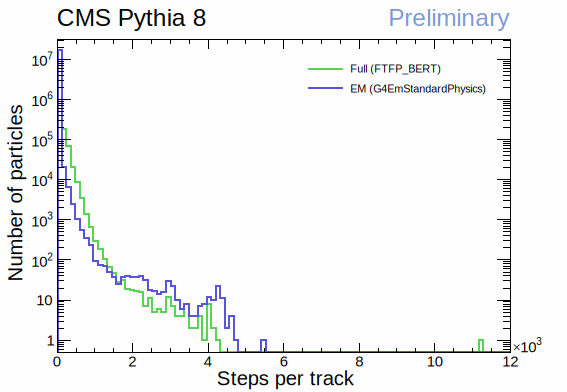
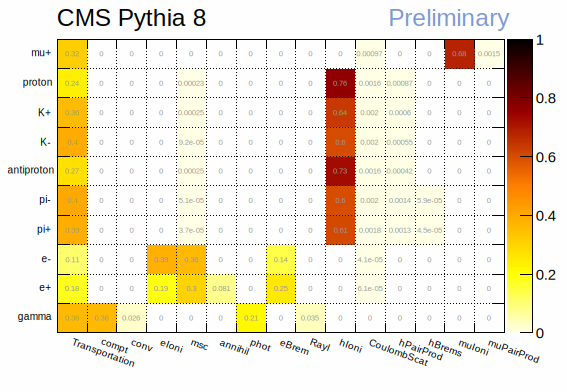

Abstract
========

This document provides an overview of the use of a fairly realistic simulation
using Pythia + Geant4 with the cms2018.gdml geometry. The lack of magnetic field
is the important caveat when it comes to compare to real CMS simulations. This
brief data analysis provides a few insights on both EM (G4EmStandardPhysics) and
full (FTFP_BERT) Geant4 physics lists. The analysis presents the number of
secondaries that are to be expected, the number of steps that each track should
undergo, and which physics processes are more relevant.

----

The Geant4-Sandbox
==================

The Geant4-Sandbox is being developed as a package of the Celeritas Project on
GitHub. It loads a specified gdml file and uses the G4ParticleGun to simulate
events. The current output is a ROOT file with 4 TTrees: *run*, *event*, *track*,
and *step*. For more information, visit:

https://github.com/celeritas-project/geant4-sandbox

The purpose of the analysis
===========================

The purpose of the analysis consists in understanding the dynamics of Geant4's
simulation. We use the ROOT output file from the Geant4-Sandbox to verify the
number of daughters produced by each particle, the average number of steps each
track undergoes, and which are the most relevant physics processes for each
particle type. This general overview will allow us to define a more efficient
path forward for developing Celeritas.

The datasets
============

The data was simulated using a CMS HEPEVT data file containing 50 events. This
analysis used the **master-648ef5a** commit. Specifications of each simulation
are shown below.

To achieve decent statistics without using too much computing time and disk
space, **2 sets of simulations** were performed:

- **Set 1**: Only *run* and *event* TTrees are filled, largely decreasing disk
  usage. This set is used to plot the distribution of number of tracks per event
  for different primaries.

- **Set 2**: *All* TTrees are recorded. This set is used to plot distributions
  of the number of steps per track, number of daughter particles each track
  produces, and which physics processes are more relevant.

Details of both datasets are presented in the table below:

+-----+--------------------------+------------------+-----------------+
| Set | Physics                  | Number of events | Number of steps |
+=====+==========================+==================+=================+
| 1   | Full (FTFP_BERT)         | 50               | N/A             |
|     +--------------------------+------------------+-----------------+
|     | EM (G4EmStandardPhysics) | 50               | N/A             |
+-----+--------------------------+------------------+-----------------+
| 2   | Full (FTFP_BERT)         | 10               | 474,729,747     |
|     +--------------------------+------------------+-----------------+
|     | EM (G4EmStandardPhysics) | 10               | 180,578,064     |
+-----+--------------------------+------------------+-----------------+

Results
=======

Tracks per event
----------------

**Set 1** is used to verify the number of tracks per simulated event for both
EM (G4EmStandardPhysics) and Full (FTFP_BERT) physics lists. The total number
of tracks differs only by a factor of 3.

.. figure:: figures/tracksPerEvent.svg

   Number of tracks per event for full (FTFP_BERT) and EM (G4EmStandardPhysics)
   physics lists. Dashed lines represent their mean values.

Daughters per track
-------------------

The number of daughters per each track ID was plotted using the track parent
information available on **Set 2**. Since each track ID is reshuffled/reused to
define different particles in different events, a cumulative histogram is
meaningless. Therefore, the plot below only shows a single event of each sample.

.. figure:: figures/daughtersPerTrackID.png
   :scale: 25%

   Number of daughters produced by each track ID.

Steps per track
---------------

From **Set 2**, the distributions of the number of steps per each track show
that most particles are fully transported with less than 100 steps. Nevertheless,
a few tracks still reach up to 5E3 steps.

   Number of steps that each track undergoes for each physics list.

Relevance of each physics process
---------------------------------

**Set 2** data allows evaluating the relevance that each physics process has in
the simulation. In this context, relevance of a process is simply the number of
steps that a given physics process method was invoked divided the total number of
steps in the simulation. The 1D histogram below presents the fraction of steps
that undergone a specific physics process, while the 2D histogram shows the
relevance of each physics process for each particle type. The separation by
particle type implies that in each row the fractions add up to 1.

.. figure:: figures/processesHist_EM.svg

   Overall contribution of each physics process for the EM physics list
   (G4EmStandardPhysics).

Relevance of each physics process for any given particle for EM physics
(G4EmStandardPhysics). Ion ionization was left out of this plot, since too many
ions are produced and are both not the focus of this overview nor very relevant
for the overall simulation (see 1D histogram). The numbers in each row add up to 1.

Preliminary conclusions
=======================

Number of tracks / daughters / steps per track
----------------------------------------------

EM physics produces roughly an average of 5E6 tracks per event, with most tracks
undergoing less than 100 steps. A few tracks may reach up to 5E3 steps.

Particles produce up to 4E3 daughters, with most producing a little less than 1E2.

Relevant physics processes
--------------------------

Muons are probably the simplest particles to implement, as muon ionization and
transport (including dE/dX) already account for nearly 100% of their simulation
steps.

Photons, electrons, and positrons need more work. Electrons need 3 physics
processes to cover ~100% of the steps, while positrons require 4. For positrons,
correctly choosing 3 of them is enough encompass ~90% of the steps. Photons also
reach ~90% of the steps with 3 processes, but need 5 to get really close to
~100%.

The table below lists, by order of relevance, the key processes for each
particle and the fraction of steps they encompass.

+-----------+---------------------------------------------+---------------+
| Particle  | Relevant physics processes                  | Steps covered |
+===========+=============================================+===============+
| Electrons | transport + eIoni + msc + eBrem             | ~100%         |
+-----------+---------------------------------------------+---------------+
| Positrons | transport + msc + eBrem + eIoni (+ annihil) | ~90% (~100%)  |
+-----------+---------------------------------------------+---------------+
| Muons     | transport + muIoni                          | ~100%         |
+-----------+---------------------------------------------+---------------+
| Photons   | transport + compt + phot (+ Rayl + conv)    | ~90% (~100%)  |
+-----------+---------------------------------------------+---------------+

----

Appendix: **G4EmStandardPhysics**
=================================

- Standard EM models cover 0-100 TeV physics for e and gammas
- Muons go up to 1 PeV
- Operational energy goes to 0, though not accurate for E < 1 keV

- gammas

  - BetheHeitler: pair production
  - Klein-Nishina: Compton scattering
  - Livermore: photoelectric and Rayleigh scattering

- e

  - Urban: multiple Coulomb scattering, 0 < E < 100 MeV
  - WentzelVI: multiple Coulomb scattering, 100 MeV < E < 100 TeV, being also combined with single Coulomb scattering
  - eBremSB + eBremLPM: Bremsstrahlung
  - Moller-Bhabha: Ionization
  - eplus2gg: positron annihilation

- mu

  - WentzelVI + eCoulombScattering: Coulomb scattering
  - MuBrem: Bremsstrahlung
  - Bragg: Ionization, mu+
  - ICRU73Q0: Ionization, mu-
  - BetheBloch: Ionization, mu+ & mu-, 200 keV < E < 1 GeV
  - MuBethBloch: Ionization, mu+ & mu-, 1 GeV < E < 100 TeV
  - muPairProduction: e+/e- pairs caused by mu+ or mu-

- pi, K, p, and pbar

  - WentzelVI: multiple Coulomb scattering
  - eCoulombScattering: Coulomb scattering
  - hBrem: Bremsstrahlung
  - hPairProduction: e-/e+ pair production
  - Bragg: Ionization

    - pi+ with E < 298 keV
    - K+ with E < 1.05 MeV
    - p with E < 2 MeV

  - ICRU73Q0: Ionization

    - pi- with E < 298 keV
    - K- with E < 1.05 MeV
    - pbar with E < 2 MeV

  - BetheBloch: Ionization, E above the aforementioned thresholds

  Appendix: **Extra plots**
  =========================

  .. figure:: figures/ElossVsProcessName.svg

     E_loss per step according to different physics processes.
