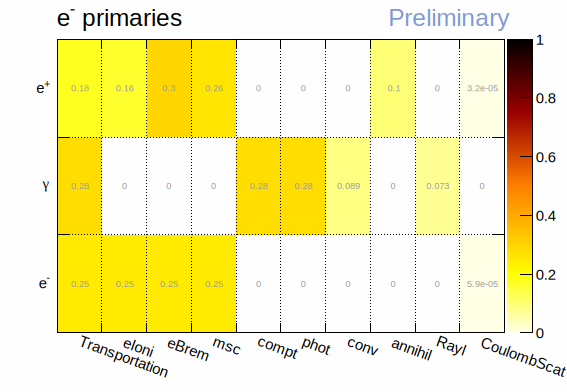
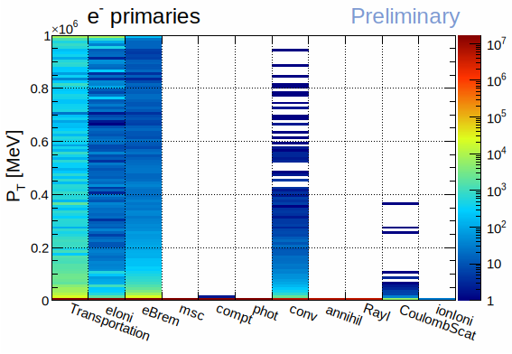

Abstract
========

This document provides an overview of the use of the **G4EmStandardPhysics** on
CMS' gdml geometry. A brief data analysis provides a few insights about
simulating leptons and photons using EM physics in CMS. The analysis presents
the number of secondaries that are to be expected, the number of steps that each
track should undergo, and which EM physics processes are more relevant.

----

The Geant4-Sandbox
==================

The Geant4-Sandbox is being developed as a package of the Celeritas Project on
GitHub. It loads a specified gdml file and uses the G4ParticleGun to simulate
events. The current output is a ROOT file with 4 TTrees: *run*, *event*, *track*,
and *step*. For more information, visit:

https://github.com/celeritas-project/geant4-sandbox

The purpose of the analysis
===========================

The purpose of the analysis consists in understanding the dynamics of Geant4's
simulation. We use the ROOT output file from the Geant4-Sandbox to check the
average number of daughters produced by each particle, the average number of
steps each track undergoes, and which are the most relevant physics processes
for each particle type. This general overview will allow us to define a more
efficient path forward for developing Celeritas.

The datasets
============

The data was simulated by placing the G4ParticleGun at the center of CMS and
simulating primaries at uniformly random distributed directions over a full
4$\pi$ solid angle. This analysis used the **master-0c7588d** commit.
Specifications of each simulation is described below.

To achieve decent statistics without using too much computing time and disk
space, **2 sets of simulations with 1 TeV primaries** were performed:

- **Set 1**: Only *run* and *event* TTrees are filled, substantially improving
  simulation time and vastly improving disk usage. This set is used to plot the
  distribution of number of tracks per event for different primaries.

- **Set 2**: *All* TTrees are recorded. This set is used to plot distributions
  of the number of steps per track, number of daughter particles that each track
  produces, and which physics processes are more relevant. Muons produce far
  less particles per event, and as such a larger number of events was needed in
  order to accrue better statistics.

Details on both datasets are presented in the table below:

+-----+------------------+------------------+-----------------+
| Set | Primary particle | Number of events | Number of steps |
+=====+==================+==================+=================+
| 1   | Electron         | 2,000            | N/A             |
|     +------------------+------------------+-----------------+
|     | Muon             | 2,000            | N/A             |
|     +------------------+------------------+-----------------+
|     | Photon           | 2,000            | N/A             |
+-----+------------------+------------------+-----------------+
| 2   | Electron         | 100              | 642,920,826     |
|     +------------------+------------------+-----------------+
|     | Muon             | 2,000            | 265,049,923     |
|     +------------------+------------------+-----------------+
|     | Photon           | 100              | 343,425,496     |
+-----+------------------+------------------+-----------------+

Results
=======

Validation
----------

For validation purposes, the following 3 figures show the directional cosine
values of all primaries from **Set 1**, confirming that they are uniformly
distributed over a 4$\pi$ solid angle.

.. figure:: figures/e_eventDir.svg

   Directional cosines of electron primaries.

.. figure:: figures/mu_eventDir.svg

   Directional cosines of muon primaries.

.. figure:: figures/gamma_eventDir.svg

   Directional cosines of photon primaries.

Tracks per event
----------------

Using data from **Set 1**, the number of tracks per simulated event reaches up to
$\approx 1.7 \times 10^6$, as seen in the next figure. Primary muons produce way
less tracks per event, with most events having 3 orders of magnitude less tracks.
The mean and standard deviation of each distribution is presented in the next
table.

.. figure:: figures/tracksPerEvent.svg

   Number of tracks per event according to different primaries.

+-----------+----------+-----------+
| Primary   |   Mean   | Std. Dev. |
+===========+==========+===========+
| Electrons | 1.43E6   | 34E3      |
+-----------+----------+-----------+
| Muons     | 49.3E3   | 137E3     |
+-----------+----------+-----------+
| Photons   | 1.44E6   | 33E3      |
+-----------+----------+-----------+

Daughters per track
-------------------

By using Geant4's track parent information available on **Set 2**, a histogram
of the number of daughters per each track ID was created. Given the fact that
each track ID number is reshuffled/reused to define different particles in
different events, a cumulative histogram is meaningless. Therefore, the plot
below only shows a randomly chosen single event of each primary sample.

.. figure:: figures/daughtersPerTrackID.png
   :scale: 20 %

   Number of daughters produced by each track ID.

Steps per track
---------------

From **Set 2**, the distributions of the number of steps per each track show
that most particles are fully transported with less than 100 steps. Muons pose a
particular case, as they travel more due to being MIPs. This results in a larger
number of tracks with a high number of steps, some reaching up to 5.000 steps.
Despite the non-negligible amount of long tracks, both mean and standard
deviations are very small for all distributions, as presented in the following
table.

.. figure:: figures/stepsPerTrack.svg

   Number of steps that each track undergoes, for each of the simulated primaries.

+-----------+----------+-----------+
| Primary   |   Mean   | Std. Dev. |
+===========+==========+===========+
| Electrons | 34.3     | 22.9      |
+-----------+----------+-----------+
| Muons     | 31.8     | 32.9      |
+-----------+----------+-----------+
| Photons   | 32.3     | 15.7      |
+-----------+----------+-----------+

Relevance of each physics process
---------------------------------

**Set 2** data allows evaluating the relevance of each physics process available
in **G4EmStandardPhysics**, which pinpoints where our efforts must be initially
directed. In this context, relevance of a process is simply the number of steps
in which a given physics process method was called divided the total number of
steps in the simulation. The set of 1D histograms below present the fraction of
steps that undergone a specific physics process, according to each primary.
Next, a set of 2D histograms is presented, showing the relevance of each physics
model according to each particle type produced. The separation by particle type
implies that in each row the fractions must add up to 1.

.. figure:: figures/processesHist_e.svg

   Overall contribution of each physics process for electron primaries. Each bin
   represents the number of steps that executed a given process divided by the
   total number of steps (i.e. the histogram's integral is 1).

.. figure:: figures/processesHist_mu.svg

   Overall contribution of each physics process for muon primaries. Each bin
   represents the number of steps that executed a given process divided by the
   total number of steps (i.e. the histogram's integral is 1).

.. figure:: figures/processesHist_gamma.svg

   Overall contribution of each physics process for photon primaries.Each bin
   represents the number of steps that executed a given process divided by the
   total number of steps (i.e. the histogram's integral is 1).

.. figure:: figures/e_ParticleVsProcess_fraction.svg

   The histogram shows the relevance of a said physics process for any given
   particle, using electron primaries. The numbers in each row add up to 1.

.. figure:: figures/mu_ParticleVsProcess_fraction.svg

  The histogram shows the relevance of a said physics process for any given
  particle, using muon primaries. The numbers in each row add up to 1.

.. figure:: figures/gamma_ParticleVsProcess_fraction.svg

   The histogram shows the relevance of a said physics process for any given
   particle, using photon primaries. The numbers in each row add up to 1.

Preliminary conclusions
=======================

Number of tracks / daughters / steps per track
----------------------------------------------

Muons produce the least number of tracks, but they may undergo through a larger
amount of steps. Electrons and photons behave very similarly in terms of how
many tracks are produced per event.

Electrons and photons may use the same device-host memory management, whereas
muons will probably need more preallocated memory for recording step data.

Relevant physics processes
--------------------------

Muons are the simplest particles to implement, as muon ionization and transport
alone account for nearly 100% of their simulation steps. Albeit incomplete,
porting muon ionization capabilities should provide a basic -- but good enough
-- framework for comparing Celeritas with Geant4.

Photons, electrons, and positrons need more work. Electrons need 3 physics
processes to cover ~100% of the steps, while positrons require 4. For positrons,
correctly choosing 3 of them is enough encompass ~90% of the steps. Photons also
reach ~90% of the steps with 3 processes, but need 5 to get really close to
~100%.

The table below lists, by order of relevance, the key processes for each
particle and the fraction of steps they encompass.

+-----------+---------------------------------------------+---------------+
| Particle  | Relevant physics processes                  | Steps covered |
+===========+=============================================+===============+
| Electrons | transport + eIoni + msc + eBrem             | ~100%         |
+-----------+---------------------------------------------+---------------+
| Positrons | transport + eBrem + msc + eIoni (+ annihil) | ~90% (~100%)  |
+-----------+---------------------------------------------+---------------+
| Muons     | transport + muIoni                          | ~100%         |
+-----------+---------------------------------------------+---------------+
| Photons   | transport + compt + phot (+ Rayl + conv)    | ~90% (~100%)  |
+-----------+---------------------------------------------+---------------+

----

Appendix: **G4EmStandardPhysics**
=================================

- Standard EM models cover 0-100 TeV physics for e and gammas
- Muons go up to 1 PeV
- Operational energy goes to 0, though not accurate for E < 1 keV

- gammas

  - BetheHeitler: pair production
  - Klein-Nishina: Compton scattering
  - Livermore: photoelectric and Rayleigh scattering

- e

  - Urban: multiple Coulomb scattering, 0 < E < 100 MeV
  - WentzelVI: multiple Coulomb scattering, 100 MeV < E < 100 TeV, being also combined with single Coulomb scattering
  - eBremSB + eBremLPM: Bremsstrahlung
  - Moller-Bhabha: Ionization
  - eplus2gg: positron annihilation

- mu

  - WentzelVI + eCoulombScattering: Coulomb scattering
  - MuBrem: Bremsstrahlung
  - Bragg: Ionization, mu+
  - ICRU73Q0: Ionization, mu-
  - BetheBloch: Ionization, mu+ & mu-, 200 keV < E < 1 GeV
  - MuBethBloch: Ionization, mu+ & mu-, 1 GeV < E < 100 TeV
  - muPairProduction: e+/e- pairs caused by mu+ or mu-

- pi, K, p, and pbar

  - WentzelVI: multiple Coulomb scattering
  - eCoulombScattering: Coulomb scattering
  - hBrem: Bremsstrahlung
  - hPairProduction: e-/e+ pair production
  - Bragg: Ionization

    - pi+ with E < 298 keV
    - K+ with E < 1.05 MeV
    - p with E < 2 MeV

  - ICRU73Q0: Ionization

    - pi- with E < 298 keV
    - K- with E < 1.05 MeV
    - pbar with E < 2 MeV

  - BetheBloch: Ionization, E above the aforementioned thresholds

Appendix: Relevant EM Physics plots
===================================

Same 2D histograms presented before, but without ion ionization for better
readability.

.. figure:: figures/mu_ParticleVsProcess_fraction_zoomed.svg

.. figure:: figures/gamma_ParticleVsProcess_fraction_zoomed.svg

Appendix: Extra plots
=====================

.. figure:: figures/mu_ProcessVsEnergy.svg

.. figure:: figures/gamma_ProcessVsEnergy.svg
